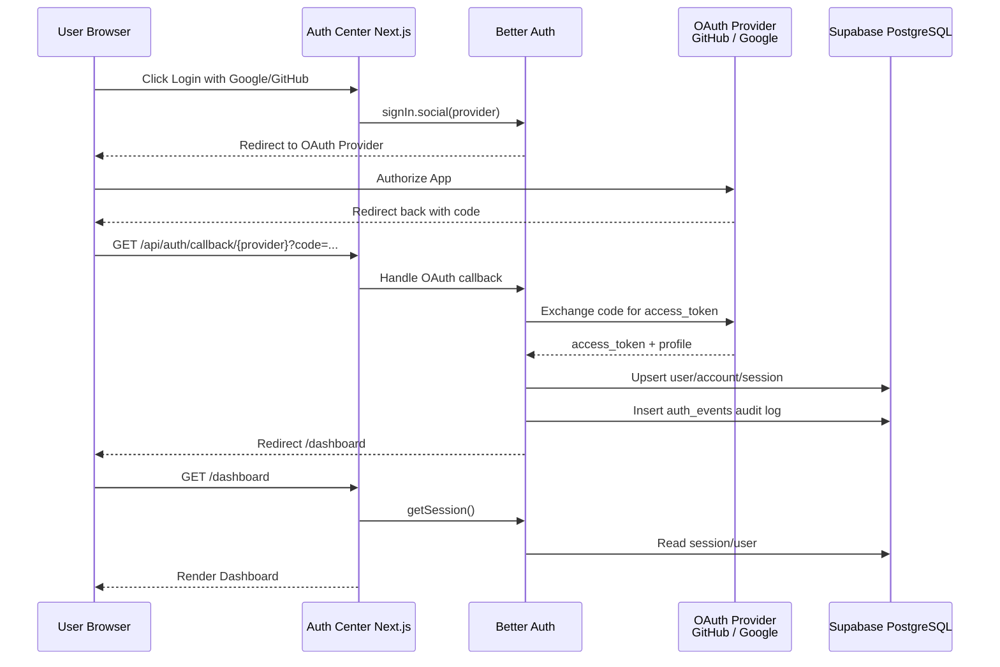
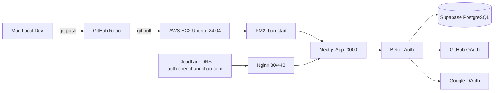
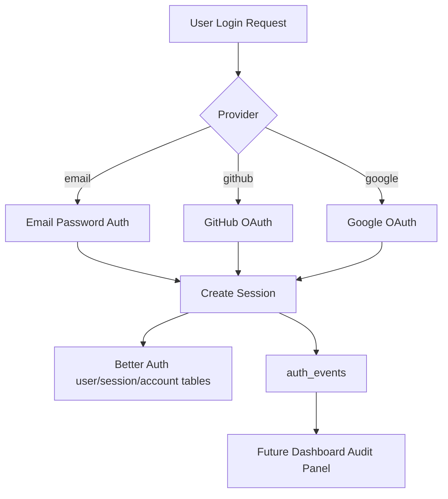

# Auth Center DevOps Log

> 项目：`auth-center` 统一身份认证中心 Demo  
> 技术栈：Next.js 16 + TypeScript + Bun + Better Auth + Supabase PostgreSQL + shadcn/ui + Tailwind CSS + next-themes + AWS EC2 + Nginx + Cloudflare  
> 目标域名：`https://auth.chenchangchao.com`  
> 日期：2026-06-25

---

## 1. 项目目标

本次目标是把一个可以放进简历的认证系统 Demo 从本地开发推进到线上可访问版本。

核心能力包括：

1. 邮箱密码注册 / 登录；
2. GitHub OAuth 登录；
3. Google OAuth 登录；
4. Better Auth 会话管理；
5. Supabase PostgreSQL 持久化用户、账户、Session；
6. `auth_events` 登录审计日志；
7. Dashboard 展示当前用户和 Session 安全字段；
8. shadcn/ui 构建界面；
9. light / dark / system 主题切换；
10. AWS EC2 + Nginx + Cloudflare 二级域名部署。

最终验证结果：

- `https://auth.chenchangchao.com/dashboard` 可以正常访问；
- Google 登录成功；
- GitHub 登录成功；
- 邮箱登录成功；
- Supabase `auth_events` 表可以查到登录审计记录。

---

## 2. 本地开发阶段

### 2.1 初始化项目

本地目录：

```bash
/Users/dustchen/workdir/auth-center
```

项目基于 Next.js App Router 创建，使用 Bun 管理依赖。

主要依赖包括：

```bash
bun add better-auth postgres pg @types/pg
bun add next-themes lucide-react
bunx shadcn@latest add button card input label avatar badge separator dropdown-menu
```

### 2.2 Supabase 数据库连接测试

先写了 `scripts/test-db.ts` 测试 Supabase PostgreSQL 是否可连接。

测试结果显示：

- 数据库连接成功；
- 当前数据库为 `postgres`；
- 当前用户为 `postgres`；
- PostgreSQL 版本为 17.6；
- 可见 schema 包括 `auth` 和 `public`；
- 原有业务表包括 `public.post_metrics`。

这里确认了：数据库不是问题，后续 Better Auth 和 audit log 可以继续基于 Supabase。

---

## 3. Better Auth 接入过程

### 3.1 初始问题：Failed to initialize database adapter

执行：

```bash
bunx @better-auth/cli generate
```

一开始报错：

```text
[BetterAuthError: Failed to initialize database adapter]
```

原因是 Better Auth 的数据库 adapter 写法不符合当前配置。后来改为 Better Auth 期望的 Kysely/Postgres 方式：

```ts
database: { db, type: "postgres" }
```

并补充：

```bash
bun add pg @types/pg
```

同时设置：

- Supabase SSL；
- `search_path=public`；
- auth route 使用 Node runtime。

最终执行成功：

```bash
bunx @better-auth/cli generate
```

输出：

```text
Schema was generated successfully!
```

生成了 Better Auth migration SQL。

---

## 4. 登录功能实现

### 4.1 邮箱密码登录

实现了 `/login` 页面，支持：

- Name；
- Email；
- Password；
- 注册；
- 登录；
- 登录中 / 注册中提示；
- 登录成功后跳转 `/dashboard`。

邮箱登录跑通后，Dashboard 能展示：

- user id；
- email；
- emailVerified；
- session id；
- createdAt；
- expiresAt；
- userAgent。

为了安全，Dashboard 后续不再直接展示 `session.token`。

### 4.2 GitHub OAuth 登录

GitHub OAuth App 本地配置：

```text
Homepage URL:
http://localhost:3000

Authorization callback URL:
http://localhost:3000/api/auth/callback/github
```

线上配置：

```text
Homepage URL:
https://auth.chenchangchao.com

Authorization callback URL:
https://auth.chenchangchao.com/api/auth/callback/github
```

GitHub 登录最终本地与线上都跑通。

### 4.3 Google OAuth 登录

Google Cloud Console 配置：

Authorized JavaScript origins：

```text
http://localhost:3000
https://auth.chenchangchao.com
```

Authorized redirect URIs：

```text
http://localhost:3000/api/auth/callback/google
https://auth.chenchangchao.com/api/auth/callback/google
```

本地遇到网络问题，但线上 EC2 环境完全跑通。

---

## 5. UI 与主题切换

### 5.1 Dashboard 美化

Dashboard 从最初的 JSON 调试页，升级为认证中心控制台：

- 用户头像；
- 用户名；
- 邮箱；
- 邮箱验证状态；
- Session 安全字段；
- 项目能力说明；
- 退出登录按钮。

### 5.2 light / dark / system 主题切换

使用：

```bash
bun add next-themes lucide-react
```

新增：

```text
src/components/theme/theme-provider.tsx
src/components/theme/mode-toggle.tsx
```

`layout.tsx` 中加入：

```tsx
<html lang="zh-CN" suppressHydrationWarning>
  <body className="min-h-screen bg-background text-foreground antialiased">
    <ThemeProvider>{children}</ThemeProvider>
  </body>
</html>
```

主题切换支持：

- light；
- dark；
- system。

### 5.3 踩坑：button 嵌套 button

一开始 `ModeToggle` 写法类似：

```tsx
<DropdownMenuTrigger>
  <Button>...</Button>
</DropdownMenuTrigger>
```

导致报错：

```text
<button> cannot be a descendant of <button>
```

原因：`DropdownMenuTrigger` 自己渲染 `button`，而 shadcn `Button` 也是 `button`。

修复方式：

不要在 `DropdownMenuTrigger` 内再套 `Button`，而是直接给 `DropdownMenuTrigger` 加 className，避免嵌套 button。

---

## 6. 登录审计表 auth_events

### 6.1 建表 SQL

在 Supabase SQL Editor 执行：

```sql
create table if not exists auth_events (
  id uuid primary key default gen_random_uuid(),
  user_id text,
  email text,
  event_type text not null,
  provider text,
  ip text,
  user_agent text,
  success boolean default true,
  metadata jsonb default '{}',
  created_at timestamp default now()
);

create index idx_auth_events_user_id on auth_events(user_id);
create index idx_auth_events_event_type on auth_events(event_type);
create index idx_auth_events_created_at on auth_events(created_at);
```

### 6.2 审计记录效果

最终 Supabase 查询：

```sql
select * from auth_events order by created_at desc;
```

可以看到记录：

| event_type | provider | email |
|---|---|---|
| sign_in | google | nicolaschan86@gmail.com |
| sign_in | github | alanmak@foxmail.com |
| sign_in | email | test@example.com |

说明登录审计链路已经跑通。

---

## 7. 本地网络踩坑总结

### 7.1 Google Fonts 下载失败

Next.js 默认模板使用 `next/font/google`，本地网络访问 Google Fonts 不稳定，导致报错：

```text
Failed to download Geist / Geist Mono / Inter from Google Fonts
```

解决：

移除 `next/font/google`，改用系统字体：

```css
font-family:
  -apple-system,
  BlinkMacSystemFont,
  "Segoe UI",
  "PingFang SC",
  "Hiragino Sans GB",
  "Microsoft YaHei",
  Arial,
  sans-serif;
```

### 7.2 Hydration mismatch

出现：

```text
Hydration failed because the server rendered HTML didn't match the client
```

其中包含：

```text
data-yd-metadata-content-site
data-yd-content-ready
```

判断为浏览器翻译插件注入属性导致，非项目代码问题。

解决：

- 关闭有道/翻译类插件；
- 或使用无痕窗口；
- 或忽略插件导致的开发警告。

### 7.3 GitHub OAuth 本地 invalid_code

GitHub 登录时报：

```text
invalid_code
ConnectTimeoutError: github.com:443
```

根因：

浏览器能访问 GitHub，但 Better Auth 服务端需要用 `code` 请求 GitHub token endpoint。Node/Bun 服务端 fetch 不一定走浏览器代理。

处理方式：

- Clash Verge 开启全局代理；
- 使用代理环境变量启动；
- 必要时直接放弃本地调试，转线上 EC2 环境测试。

### 7.4 Google OAuth 本地 invalid_code

Google 登录本地先遇到：

```text
redirect_uri_mismatch
```

修复 Google Console redirect URI 后，又遇到：

```text
ConnectTimeoutError: oauth2.googleapis.com:443
```

根因同样是：本地服务端请求 Google token endpoint 超时。

尝试过：

- Clash 全局代理；
- `HTTP_PROXY` / `HTTPS_PROXY` / `ALL_PROXY`；
- undici `ProxyAgent`；

仍不稳定。

最终解决：

直接部署到 AWS EC2，线上 Google OAuth 一次跑通。

---

## 8. EC2 部署流程

### 8.1 服务器基础环境

EC2 配置：

```text
t3.medium
Ubuntu 24.04 LTS
30 GiB gp3
```

安装基础工具：

```bash
sudo apt update && sudo apt upgrade -y
sudo apt install -y curl git unzip htop nginx ufw build-essential
```

安装 Bun：

```bash
curl -fsSL https://bun.sh/install | bash
source ~/.bashrc
bun --version
```

安装 Node.js LTS 和 PM2：

```bash
curl -fsSL https://deb.nodesource.com/setup_lts.x | sudo -E bash -
sudo apt install -y nodejs
sudo npm install -g pm2
```

### 8.2 拉取代码

```bash
mkdir -p ~/apps
cd ~/apps
git clone <github-repo-url>
cd auth-center
bun install
```

### 8.3 生产环境变量

`.env.production`：

```env
DATABASE_URL="Supabase Session Pooler URL"

BETTER_AUTH_SECRET="production-secret"
BETTER_AUTH_URL="https://auth.chenchangchao.com"
NEXT_PUBLIC_BETTER_AUTH_URL="https://auth.chenchangchao.com"

GITHUB_CLIENT_ID="xxx"
GITHUB_CLIENT_SECRET="xxx"

GOOGLE_CLIENT_ID="xxx"
GOOGLE_CLIENT_SECRET="xxx"
```

### 8.4 构建与启动

```bash
bun run build
pm2 start "bun start" --name auth-center
pm2 save
pm2 startup
```

### 8.5 Nginx 反向代理

`/etc/nginx/sites-available/auth-center`：

```nginx
server {
    listen 80;
    server_name auth.chenchangchao.com;

    location / {
        proxy_pass http://127.0.0.1:3000;
        proxy_http_version 1.1;

        proxy_set_header Host $host;
        proxy_set_header X-Real-IP $remote_addr;
        proxy_set_header X-Forwarded-For $proxy_add_x_forwarded_for;
        proxy_set_header X-Forwarded-Proto $scheme;

        proxy_set_header Upgrade $http_upgrade;
        proxy_set_header Connection "upgrade";
    }
}
```

启用：

```bash
sudo ln -s /etc/nginx/sites-available/auth-center /etc/nginx/sites-enabled/auth-center
sudo nginx -t
sudo systemctl reload nginx
```

### 8.6 Cloudflare DNS

添加记录：

```text
Type: A
Name: auth
IPv4 address: EC2 Public IPv4
TTL: Auto
Proxy status: DNS only 或 Proxied
```

### 8.7 HTTPS

使用 Certbot：

```bash
sudo apt install -y certbot python3-certbot-nginx
sudo certbot --nginx -d auth.chenchangchao.com
```

---

## 9. 主要流程图

### 9.1 用户登录流程



### 9.2 部署架构图



### 9.3 数据流与审计日志



---

## 10. 当前项目状态

已完成：

- Next.js 项目初始化；
- Better Auth 接入；
- Supabase PostgreSQL 连接；
- Better Auth migration 生成与执行；
- 邮箱注册 / 登录；
- GitHub OAuth；
- Google OAuth；
- Dashboard 用户信息展示；
- 安全字段展示，不直接暴露 session token；
- 退出登录 loading；
- 登录中 / 注册中 / OAuth 跳转中提示；
- shadcn/ui；
- light / dark / system 主题切换；
- 登录审计表 `auth_events`；
- AWS EC2 部署；
- Cloudflare 二级域名；
- 线上 Google OAuth 跑通。

---

## 11. 后续需要完善的点

### 11.1 登录审计可视化

当前 `auth_events` 已经写入数据库，但 Dashboard 还没有展示。

建议新增：

```text
/dashboard/security
```

展示：

- 最近 20 条登录记录；
- provider；
- email；
- IP；
- user agent；
- success / failure；
- 登录时间。

### 11.2 RBAC 权限系统

新增角色：

```text
admin
user
guest
```

可设计表：

```sql
user_roles
role_permissions
```

功能：

- admin 才能查看所有用户登录日志；
- 普通 user 只能查看自己的登录日志；
- middleware / server action 权限校验；
- Dashboard 根据角色展示不同菜单。

### 11.3 Account Linking

当前 Google、GitHub、Email 可能创建不同账号。

后续可以实现：

- 同一个 email 自动关联 provider；
- 用户中心展示已绑定账号；
- 支持解绑 GitHub / Google；
- 防止账号劫持。

### 11.4 Email Verification / Magic Link

邮箱密码登录目前是基础版。

后续可以增强：

- 邮箱验证；
- Magic Link 登录；
- 重置密码；
- 邮件模板；
- Resend 发信服务。

### 11.5 安全增强

建议继续做：

- 登录失败次数限制；
- IP 风险提示；
- 异地登录提醒；
- session 列表；
- 一键踢下线；
- CSRF / cookie secure 配置检查；
- 生产环境日志脱敏。

### 11.6 DevOps 增强

后续可以升级：

- GitHub Actions 自动部署到 EC2；
- `.env.production` 使用服务器本地管理或 AWS Secrets Manager；
- PM2 日志轮转；
- Nginx access/error log 监控；
- UptimeRobot / Better Stack 监控；
- AWS Budget 告警；
- Cloudflare WAF 基础规则。

---

## 12. 简历表述建议

可以写成：

> 统一身份认证中心 Auth Center：基于 Next.js App Router、Better Auth 与 Supabase PostgreSQL 实现多登录方式认证系统，支持邮箱密码、GitHub OAuth、Google OAuth 登录；设计用户、账户、Session 与登录审计日志表，记录 provider、IP、User-Agent、登录时间等安全事件；使用 shadcn/ui 与 next-themes 实现响应式 Dashboard 与 light/dark/system 主题切换；项目部署至 AWS EC2，通过 Nginx 反向代理、Cloudflare DNS 和 HTTPS 绑定 `auth.chenchangchao.com`，形成完整的云端认证 Demo。

---

## 13. 关键经验总结

1. OAuth 难点不只在代码，更在 redirect URI、服务端网络、token exchange。
2. 浏览器能访问 Google/GitHub，不代表 Next.js 服务端 fetch 能访问。
3. 本地代理链路复杂时，OAuth 最好直接在线上域名环境调试。
4. `next/font/google` 在国内网络环境容易导致 build/dev 报错，简历 Demo 可优先使用系统字体。
5. shadcn/ui 组件组合时要避免 button 嵌套 button。
6. 登录 Demo 如果加入审计日志，就从“套库登录”升级为“认证系统设计”。
7. EC2 + Nginx + Cloudflare 是非常适合作品集项目的部署组合。

---

## 14. 下一步推荐路线

优先级建议：

```text
P0: Dashboard 展示 auth_events 登录审计日志
P1: RBAC 角色权限系统
P2: GitHub Actions 自动部署
P3: Account Linking
P4: Magic Link / Reset Password
P5: 安全风控与异常登录提醒
```

最推荐下一步：

> 做 `/dashboard/security` 登录审计页面，把 `auth_events` 从数据库能力变成前端可见能力。

